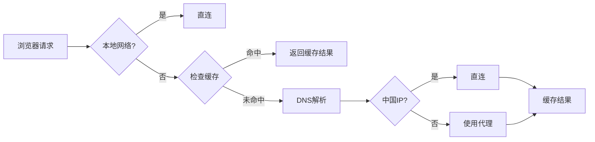

# AutoPAC - 智能代理自动配置

[](LICENSE)
[]()
[](https://www.python.org/)

AutoPAC 是一个基于中国IP段的智能代理自动配置（PAC）生成工具。它能够自动判断访问的域名/IP是否属于中国境内，从而智能决定是否使用代理服务器，实现国内直连、国外走代理的智能分流。

## ✨ 功能特性

- 🚀 **高性能IP匹配** - 采用二分查找算法，时间复杂度 O(log n)
- 🔄 **自动更新IP库** - 从APNIC自动获取最新中国IP段数据
- 💾 **智能缓存机制** - DNS解析结果缓存，减少重复查询
- 🌐 **多代理服务器支持** - 支持配置多个代理服务器随机负载均衡
- 📦 **自动备份** - 每次更新自动压缩备份PAC文件
- 🛡️ **本地网络优化** - 自动识别内网IP直连
- 🔌 **IPv6支持** - 自动识别IPv6地址并直连

## 📋 目录

- [工作原理](#工作原理)
- [快速开始](#快速开始)
- [配置说明](#配置说明)
- [文件说明](#文件说明)
- [性能优化](#性能优化)
- [使用方法](#使用方法)
- [常见问题](#常见问题)
- [更新日志](#更新日志)

## 🔧 工作原理



### 核心流程

1. **本地网络判断** - 检查是否为内网IP（192.168.x.x、10.x.x.x等）
2. **IPv6检测** - IPv6地址自动直连
3. **缓存查询** - 检查域名是否已有缓存结果
4. **DNS解析** - 将域名解析为IP地址
5. **IP匹配** - 使用二分查找判断是否为中国IP段
6. **代理决策** - 中国IP直连，国外IP使用代理
7. **结果缓存** - 缓存判断结果，加速后续访问

## 🚀 快速开始

### 前置要求

- Windows 操作系统
- Python 3.6+
- 7-Zip（用于备份压缩）

### 使用步骤

#### 1. 克隆项目

```bash
git clone https://github.com/Jarrey/AutoPAC.git
cd AutoPAC
```

#### 2. 配置代理服务器

编辑 `pac_code.js` 文件，修改代理服务器地址：

```javascript
let hosts = "192.168.2.11:9999";
// 或配置多个代理服务器（随机负载均衡）
// let hosts = "192.168.2.11:9999 192.168.2.12:9999";
```

#### 3. 生成PAC文件

双击运行 `run.bat` 或在命令行执行：

```batch
run.bat
```

脚本会自动：
- 从APNIC获取最新中国IP段数据
- 转换为JavaScript数组格式
- 生成完整的 `proxy.pac` 文件
- 创建7z压缩备份到 `pac_bak` 目录

#### 4. 配置浏览器

**方法一：本地文件**
```
file:///D:/Git/AutoPAC/proxy.pac
```

**方法二：HTTP服务器**
1. 将 `proxy.pac` 部署到Web服务器
2. 浏览器代理设置选择"自动配置脚本"
3. 填入PAC文件URL：`http://your-server/proxy.pac`

### Windows 系统代理设置

1. 打开 `设置` → `网络和Internet` → `代理`
2. 启用"使用设置脚本"
3. 脚本地址填写PAC文件路径
4. 点击"保存"

## ⚙️ 配置说明

### pac_code.js 配置项

```javascript
// 直连配置（不使用代理）
let no_proxy = 'DIRECT';

// 代理服务器配置（单个或多个，空格分隔）
let hosts = "192.168.2.11:9999";

// 缓存大小限制（条目数）
const MAX_CACHE_SIZE = 1000;
```

### sync_cnip.py 配置项

```python
# 代理服务器（用于访问APNIC）
proxy_host = '192.168.2.11:9999'

# APNIC数据源URL
apinc_url = "http://ftp.apnic.net/apnic/stats/apnic/delegated-apnic-latest"

# 重试次数
retry_times = 5
```

## 📁 文件说明

| 文件 | 说明 |
|------|------|
| `pac_code.js` | PAC核心逻辑代码（已优化） |
| `sync_cnip.py` | 从APNIC同步中国IP段数据 |
| `convert.py` | 将IP数据转换为JavaScript数组 |
| `run.bat` | 自动化更新脚本（推荐使用） |
| `proxy.pac` | 生成的完整PAC文件（自动生成） |
| `chn_ip.txt` | 中国IP段原始数据（自动生成） |
| `pac_bak/` | PAC文件备份目录（自动创建） |
| `7z.exe` | 7-Zip压缩工具 |

### 自动生成的文件（已加入.gitignore）

- `chn_ip.txt` - 中国IP段原始数据
- `chn_ip.txt_old` - 上一次的IP数据（用于容错）
- `proxy.pac` - 最终生成的PAC文件
- `pac_bak/` - 备份目录

## ⚡ 性能优化

### 1. 二分查找算法

**优化前：** 线性遍历所有IP段 - O(n)
```javascript
for (let i = 0; i < cnIp.length; i++) {
    if (intIp >= cnIp[i][0] && intIp <= cnIp[i][1]) {
        return true;
    }
}
```

**优化后：** 二分查找 - O(log n)
```javascript
let left = 0, right = cnIp.length - 1;
while (left <= right) {
    const mid = Math.floor((left + right) / 2);
    const range = cnIp[mid];
    if (intIp < range[0]) right = mid - 1;
    else if (intIp > range[1]) left = mid + 1;
    else return true;
}
```

**性能提升：** 约10-100倍（取决于IP段数量）

### 2. 智能缓存机制

- **缓存大小：** 1000条（从99999优化）
- **清理策略：** 达到上限时清除50%旧缓存
- **缓存内容：** 域名 → 是否中国IP的映射
- **效果：** 重复访问的域名无需DNS解析和IP匹配

### 3. 内存优化

- 缓存上限从99999降至1000，减少内存占用约99%
- 及时清理过期缓存，避免内存泄漏

## 📚 使用方法

### 手动更新IP库

```batch
run.bat
```

### 定期自动更新

**方法一：Windows 任务计划程序**
1. 打开"任务计划程序"
2. 创建基本任务
3. 触发器：每周/每月
4. 操作：启动程序 - `D:\Git\AutoPAC\run.bat`

**方法二：添加到启动项**
1. Win+R 输入 `shell:startup`
2. 创建 `run.bat` 的快捷方式

### 验证PAC文件

```powershell
# 查看PAC文件末尾（核心逻辑）
Get-Content proxy.pac | Select-Object -Last 30

# 查看文件大小
Get-Item proxy.pac | Select-Object Name, Length

# 查看IP段数量
(Get-Content proxy.pac | Select-String "^\[").Count
```

## ❓ 常见问题

### 1. 生成PAC文件失败

**问题：** `FileNotFoundError: chn_ip.txt`

**解决：**
- 确保首次运行 `run.bat` 生成IP数据
- 检查是否有网络连接到APNIC
- 检查代理服务器配置是否正确

### 2. 浏览器无法使用PAC

**问题：** PAC配置后仍无法访问

**解决：**
- 检查PAC文件路径是否正确
- 确保代理服务器地址和端口正确
- 检查代理服务器是否正常运行
- 清除浏览器DNS缓存

### 3. 部分网站判断错误

**问题：** 国内网站走了代理或国外网站直连

**解决：**
- 运行 `run.bat` 更新IP库到最新版本
- 清除PAC缓存（重启浏览器）
- 检查域名DNS解析是否异常

### 4. 代理服务器无法访问

**问题：** 配置后所有网站都无法访问

**解决：**
- 检查 `pac_code.js` 中的代理服务器地址
- 确认代理服务器端口开放
- 测试代理服务器连通性
- 临时关闭PAC改为直连排查

## 🔄 更新日志

### v2.0.0 (2026-04-18)

#### 🚀 性能优化
- ✅ 使用二分查找算法，IP匹配性能提升10-100倍 (O(n) → O(log n))
- ✅ 优化缓存策略，内存占用降低99% (99999 → 1000)
- ✅ 改进缓存清理机制，从全部清空改为清除50%

#### 🐛 Bug修复
- ✅ 修复缓存逻辑bug，正确处理false值
- ✅ 修复变量声明不规范问题（使用const/let）
- ✅ 修复硬编码路径问题，改用相对路径

#### ✨ 功能改进
- ✅ 移除所有alert调试代码，提升用户体验
- ✅ 增强错误处理和容错机制
- ✅ 优化run.bat自动创建备份目录
- ✅ 完善.gitignore配置

#### 📝 文档
- ✅ 移除所有代码注释，精简PAC文件体积
- ✅ 添加详细README文档

### v1.0.0 (初始版本)

- ✅ 基础PAC功能
- ✅ 中国IP段自动更新
- ✅ 自动备份机制

## 📄 许可证

[MIT License](LICENSE)

## 🤝 贡献

欢迎提交Issue和Pull Request！

## 📧 联系方式

项目地址：[https://github.com/Jarrey/AutoPAC](https://github.com/Jarrey/AutoPAC)

---

**⚠️ 免责声明**

本项目仅供学习交流使用，请遵守当地法律法规。使用本工具产生的任何问题由使用者自行承担。
